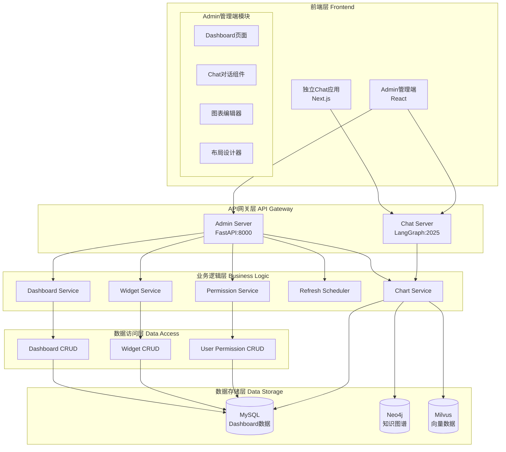
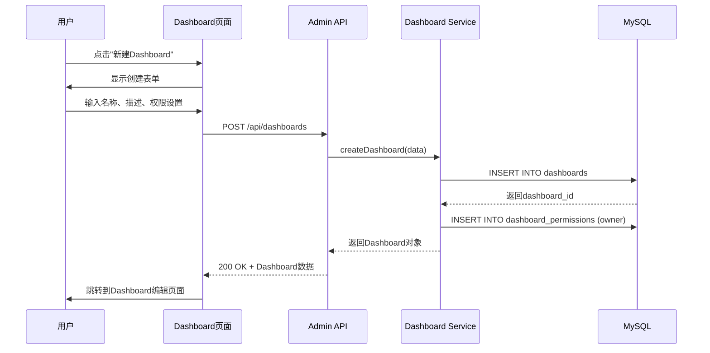
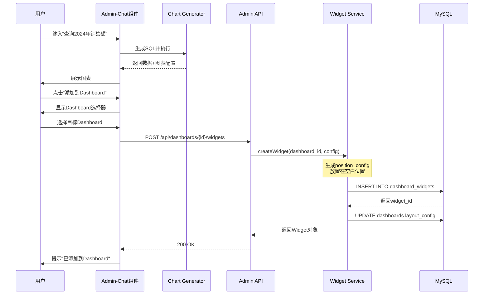
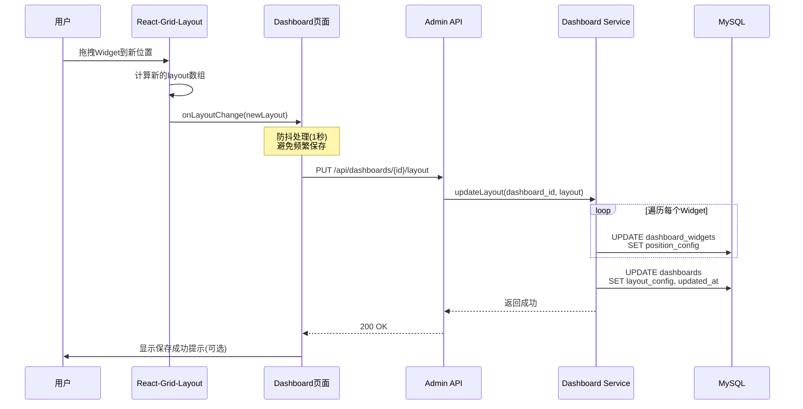
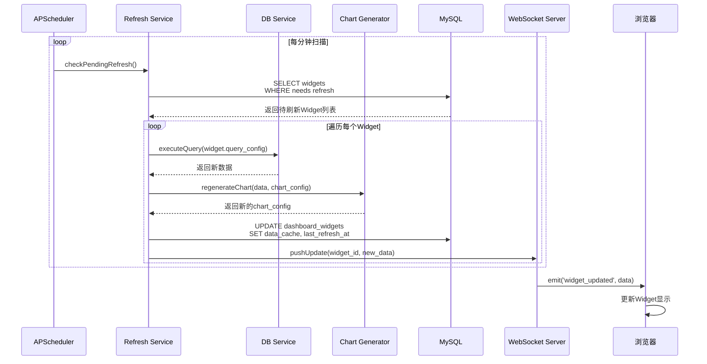
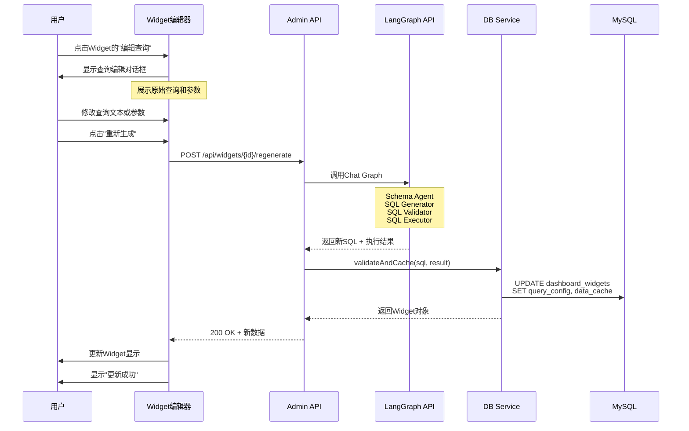
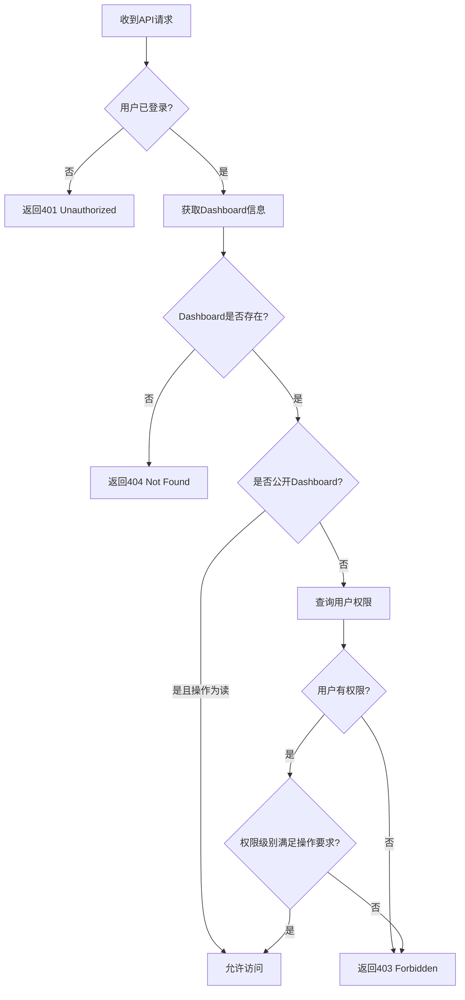

# BI Dashboard与Chat集成功能设计文档

## 一、需求概述

### 1.1 业务目标

在现有的Chat-To-DB智能查询系统基础上,增加完整的BI Dashboard仪表盘功能,支持数据可视化、实时刷新和拖拽式布局设计。将Admin管理端升级为集成式数据分析平台,同时保持独立Chat应用的功能。

### 1.2 核心需求

| 需求编号 | 需求描述 | 优先级 |
|---------|---------|--------|
| R1 | 在Admin管理端实现BI Dashboard仪表盘功能 | P0 |
| R2 | 支持从Admin管理端Chat生成的图表添加到Dashboard | P0 |
| R3 | 支持拖拽式自由画布设计,调整图表位置和大小 | P0 |
| R4 | 每个图表组件支持独立的定时刷新配置 | P0 |
| R5 | 在Admin管理端集成Chat对话功能 | P0 |
| R6 | 支持修改图表的查询条件并重新生成SQL | P0 |
| R7 | 支持多用户的Dashboard权限管理 | P0 |
| R8 | 保持独立Chat应用的现有功能不变 | P0 |

### 1.3 系统边界

**包含范围:**
- Admin管理端Dashboard页面及相关功能
- Admin管理端Chat对话集成
- Dashboard的CRUD操作API
- 图表组件的定时刷新机制
- 用户权限和Dashboard访问控制

**不包含范围:**
- 独立Chat应用的功能修改(保持原样)
- 跨系统的Dashboard共享
- 移动端专用界面
- 离线模式支持

## 二、系统架构设计

### 2.1 整体架构



### 2.2 功能模块划分

| 模块名称 | 职责描述 | 技术实现 |
|---------|---------|---------|
| Dashboard管理模块 | 仪表盘的创建、编辑、删除、查询 | React + Ant Design |
| Widget组件模块 | 图表组件的渲染、配置、交互 | React + Recharts/AntV |
| 布局设计器 | 拖拽式自由画布,支持组件位置和大小调整 | React + react-grid-layout |
| Chat集成模块 | Admin端的对话功能,生成图表并添加到Dashboard | React + 现有Chat组件复用 |
| 刷新调度器 | 管理图表的定时刷新任务 | Python + APScheduler |
| 权限管理模块 | 用户对Dashboard的访问权限控制 | FastAPI + JWT |
| 查询编辑器 | 编辑图表的查询条件,重新生成SQL | React + Monaco Editor |

### 2.3 技术栈选型

**前端技术:**
- **布局引擎**: react-grid-layout (支持拖拽、调整大小、响应式)
- **图表库**: Recharts (已有) + AntV G2Plot (高级图表)
- **编辑器**: Monaco Editor (SQL编辑)
- **状态管理**: React Context + Hooks
- **UI组件**: Ant Design (已有)

**后端技术:**
- **定时任务**: APScheduler (Python)
- **WebSocket**: Socket.IO (实时数据推送)
- **缓存**: Redis (图表数据缓存)
- **任务队列**: Celery (可选,用于异步刷新)

## 三、数据模型设计

### 3.1 Dashboard数据表

**表名:** `dashboards`

| 字段名 | 类型 | 约束 | 说明 |
|-------|------|------|------|
| id | BIGINT | PK, AUTO_INCREMENT | 仪表盘ID |
| name | VARCHAR(255) | NOT NULL | 仪表盘名称 |
| description | TEXT | NULL | 仪表盘描述 |
| owner_id | BIGINT | NOT NULL | 创建者ID |
| layout_config | JSON | NOT NULL | 布局配置(存储组件位置) |
| is_public | BOOLEAN | DEFAULT FALSE | 是否公开 |
| tags | JSON | NULL | 标签列表 |
| created_at | TIMESTAMP | DEFAULT CURRENT_TIMESTAMP | 创建时间 |
| updated_at | TIMESTAMP | ON UPDATE CURRENT_TIMESTAMP | 更新时间 |
| deleted_at | TIMESTAMP | NULL | 软删除时间 |

**索引:**
- PRIMARY KEY: `id`
- INDEX: `idx_owner_id` ON `owner_id`
- INDEX: `idx_created_at` ON `created_at`

### 3.2 Widget组件表

**表名:** `dashboard_widgets`

| 字段名 | 类型 | 约束 | 说明 |
|-------|------|------|------|
| id | BIGINT | PK, AUTO_INCREMENT | 组件ID |
| dashboard_id | BIGINT | NOT NULL, FK | 所属仪表盘ID |
| widget_type | VARCHAR(50) | NOT NULL | 组件类型(chart/table/text) |
| title | VARCHAR(255) | NOT NULL | 组件标题 |
| connection_id | BIGINT | NOT NULL, FK | 数据库连接ID |
| query_config | JSON | NOT NULL | 查询配置(SQL/参数) |
| chart_config | JSON | NULL | 图表配置 |
| position_config | JSON | NOT NULL | 位置配置(x/y/w/h) |
| refresh_interval | INT | DEFAULT 0 | 刷新间隔(秒,0=不刷新) |
| last_refresh_at | TIMESTAMP | NULL | 最后刷新时间 |
| data_cache | JSON | NULL | 缓存的数据 |
| created_at | TIMESTAMP | DEFAULT CURRENT_TIMESTAMP | 创建时间 |
| updated_at | TIMESTAMP | ON UPDATE CURRENT_TIMESTAMP | 更新时间 |

**索引:**
- PRIMARY KEY: `id`
- INDEX: `idx_dashboard_id` ON `dashboard_id`
- FOREIGN KEY: `dashboard_id` REFERENCES `dashboards(id)` ON DELETE CASCADE
- FOREIGN KEY: `connection_id` REFERENCES `db_connections(id)`

**query_config JSON结构:**
```json
{
  "original_query": "查询2024年销售额前10的产品",
  "generated_sql": "SELECT product_name, SUM(amount) as total...",
  "parameters": {
    "year": 2024,
    "limit": 10
  },
  "editable_params": ["year", "limit"],
  "conversation_id": "uuid"
}
```

**position_config JSON结构:**
```json
{
  "x": 0,
  "y": 0,
  "w": 6,
  "h": 4,
  "minW": 2,
  "minH": 2,
  "maxW": 12,
  "maxH": 12
}
```

### 3.3 Dashboard权限表

**表名:** `dashboard_permissions`

| 字段名 | 类型 | 约束 | 说明 |
|-------|------|------|------|
| id | BIGINT | PK, AUTO_INCREMENT | 权限ID |
| dashboard_id | BIGINT | NOT NULL, FK | 仪表盘ID |
| user_id | BIGINT | NOT NULL | 用户ID |
| permission_level | VARCHAR(20) | NOT NULL | 权限级别(owner/editor/viewer) |
| granted_by | BIGINT | NOT NULL | 授权人ID |
| created_at | TIMESTAMP | DEFAULT CURRENT_TIMESTAMP | 创建时间 |

**索引:**
- PRIMARY KEY: `id`
- UNIQUE INDEX: `idx_dashboard_user` ON `(dashboard_id, user_id)`
- FOREIGN KEY: `dashboard_id` REFERENCES `dashboards(id)` ON DELETE CASCADE

**permission_level说明:**
- `owner`: 拥有者,可以删除Dashboard
- `editor`: 编辑者,可以修改布局和组件
- `viewer`: 查看者,只能查看

### 3.4 用户表扩展

**表名:** `users` (新增或扩展现有用户表)

| 字段名 | 类型 | 约束 | 说明 |
|-------|------|------|------|
| id | BIGINT | PK, AUTO_INCREMENT | 用户ID |
| username | VARCHAR(100) | UNIQUE, NOT NULL | 用户名 |
| email | VARCHAR(255) | UNIQUE, NOT NULL | 邮箱 |
| password_hash | VARCHAR(255) | NOT NULL | 密码哈希 |
| display_name | VARCHAR(100) | NULL | 显示名称 |
| avatar_url | VARCHAR(500) | NULL | 头像URL |
| role | VARCHAR(20) | DEFAULT 'user' | 角色(admin/user) |
| is_active | BOOLEAN | DEFAULT TRUE | 是否激活 |
| created_at | TIMESTAMP | DEFAULT CURRENT_TIMESTAMP | 创建时间 |
| last_login_at | TIMESTAMP | NULL | 最后登录时间 |

## 四、核心功能流程设计

### 4.1 Dashboard创建流程



**验证规则:**
- Dashboard名称长度: 1-255字符
- 同一用户下Dashboard名称不能重复
- 描述长度: 0-2000字符
- 初始layout_config为空数组

### 4.2 从Chat添加图表到Dashboard流程



**Widget位置自动分配策略:**
1. 查询Dashboard当前所有Widget的position_config
2. 计算布局网格的空白区域
3. 优先放置在最上方的空白区域
4. 如果无空白区域,放置在最底部
5. 默认尺寸: w=6, h=4 (占据半行)

### 4.3 拖拽调整布局流程



**布局约束:**
- 网格列数: 12列
- 最小组件尺寸: 2列 × 2行
- 最大组件尺寸: 12列 × 12行
- 禁止组件重叠(自动调整)
- 支持响应式布局(移动端自动变为1列)

### 4.4 图表定时刷新流程



**刷新策略:**
- 每个Widget独立配置刷新间隔(秒)
- 支持的间隔: 30秒、1分钟、5分钟、15分钟、30分钟、1小时、不刷新
- 后台定时任务每分钟扫描一次
- 计算公式: `current_time - last_refresh_at >= refresh_interval`
- 刷新失败时,记录错误日志,不影响其他Widget

**缓存机制:**
- 刷新成功后,将数据存入`data_cache`字段
- 用户首次打开Dashboard时,先展示缓存数据
- 后台异步执行刷新,更新后推送到前端
- 缓存数据保留最近一次的查询结果

### 4.5 编辑查询条件并重新生成SQL流程



**编辑模式:**
1. **简单参数编辑**: 只修改参数值(如年份、limit),保持SQL结构不变
2. **完全重新生成**: 修改自然语言查询,调用LangGraph重新生成SQL

**query_config更新规则:**
- 保留原始`original_query`
- 更新`generated_sql`
- 更新`parameters`
- 新增`edit_history`记录修改历史

## 五、页面与交互设计

### 5.1 Admin管理端页面结构

```
Admin管理端 (frontend/admin)
├── 侧边栏导航
│   ├── 首页
│   ├── 连接管理
│   ├── Schema管理
│   ├── 知识图谱
│   ├── 值映射
│   ├── Dashboard (新增) ⭐
│   │   ├── 我的Dashboard
│   │   ├── 共享给我的
│   │   └── 公开Dashboard
│   └── Chat对话 (新增) ⭐
│
└── 主内容区
    ├── DashboardListPage (新增)
    ├── DashboardEditorPage (新增)
    ├── AdminChatPage (新增)
    └── 现有页面...
```

### 5.2 Dashboard列表页面 (DashboardListPage)

**页面组成:**

| 区域 | 组件 | 功能描述 |
|-----|------|---------|
| 顶部工具栏 | 搜索框 + 创建按钮 | 搜索Dashboard、新建Dashboard |
| 筛选标签 | Tabs组件 | 我的Dashboard / 共享给我的 / 公开 |
| Dashboard卡片列表 | Card Grid | 展示Dashboard缩略图、名称、描述 |
| 卡片操作按钮 | Dropdown | 编辑、复制、删除、权限管理 |

**卡片信息展示:**
- Dashboard名称
- 创建者头像和名称
- Widget数量
- 最后更新时间
- 缩略图(Dashboard的第一屏截图)

### 5.3 Dashboard编辑页面 (DashboardEditorPage)

**布局结构:**

```
┌─────────────────────────────────────────────────────┐
│ 顶部工具栏                                           │
│ [Dashboard名称] [保存] [预览] [权限] [设置] [返回]    │
├─────────────────────────────────────────────────────┤
│                                                     │
│                                                     │
│         拖拽式布局画布 (react-grid-layout)            │
│                                                     │
│  ┌──────────┐  ┌──────────┐                        │
│  │ Widget 1 │  │ Widget 2 │                        │
│  │ 柱状图   │  │ 折线图   │                        │
│  └──────────┘  └──────────┘                        │
│                                                     │
│  ┌──────────────────────────┐                      │
│  │      Widget 3            │                      │
│  │      数据表格            │                      │
│  └──────────────────────────┘                      │
│                                                     │
└─────────────────────────────────────────────────────┘
```

**Widget组件结构:**

每个Widget包含:
1. **头部**: 标题 + 操作按钮(刷新、编辑、删除)
2. **内容区**: 图表或数据展示
3. **底部**: 最后刷新时间 + 数据源信息
4. **拖拽手柄**: 支持拖拽移动
5. **缩放手柄**: 支持调整大小

**Widget编辑对话框:**
- 标题编辑
- 查询条件编辑(原始查询 + 参数)
- 图表类型切换
- 图表配置(颜色、坐标轴、图例)
- 刷新间隔设置
- 删除Widget

### 5.4 Admin Chat对话页面 (AdminChatPage)

**布局设计:**

```
┌─────────────────────────────────────────────────────┐
│ Chat对话区 (左侧或全屏)                              │
│ ┌─────────────────────────────────────────────┐    │
│ │ 对话历史                                     │    │
│ │ User: 查询2024年销售额                       │    │
│ │ AI: [SQL结果] [图表]                        │    │
│ │     [添加到Dashboard按钮]                    │    │
│ │                                              │    │
│ │ User: 显示产品分类占比                       │    │
│ │ AI: [SQL结果] [饼图]                        │    │
│ │     [添加到Dashboard按钮]                    │    │
│ └─────────────────────────────────────────────┘    │
│                                                     │
│ ┌─────────────────────────────────────────────┐    │
│ │ 输入框                                       │    │
│ │ [连接选择器] [发送]                          │    │
│ └─────────────────────────────────────────────┘    │
└─────────────────────────────────────────────────────┘
```

**与独立Chat应用的区别:**
- 复用现有Chat组件逻辑
- 增加"添加到Dashboard"按钮
- 集成在Admin管理端导航中
- 共享数据库连接配置
- 独立的对话历史(不与外部Chat共享)

### 5.5 交互细节

**拖拽交互:**
- 拖拽时显示半透明预览
- 释放时播放平滑动画
- 自动吸附网格
- 显示辅助对齐线

**刷新交互:**
- 手动刷新: 点击Widget的刷新按钮
- 自动刷新: 显示倒计时环形进度条
- 刷新中: 显示Loading遮罩
- 刷新失败: 显示错误提示,保留旧数据

**权限交互:**
- Viewer: 只能查看,不能编辑
- Editor: 可以添加/编辑/删除Widget
- Owner: 可以管理权限、删除Dashboard

## 六、API接口设计

### 6.1 Dashboard管理接口

#### 6.1.1 获取Dashboard列表

```
GET /api/dashboards
```

**Query参数:**
- `scope`: 范围 (mine / shared / public)
- `page`: 页码 (默认1)
- `page_size`: 每页数量 (默认20)
- `search`: 搜索关键词
- `sort_by`: 排序字段 (created_at / updated_at / name)
- `order`: 排序方向 (asc / desc)

**响应:**
```json
{
  "total": 50,
  "page": 1,
  "page_size": 20,
  "items": [
    {
      "id": 1,
      "name": "销售分析仪表盘",
      "description": "展示2024年销售数据分析",
      "owner": {
        "id": 10,
        "username": "alice",
        "display_name": "Alice Wang"
      },
      "widget_count": 6,
      "is_public": false,
      "permission_level": "owner",
      "created_at": "2024-01-15T10:00:00Z",
      "updated_at": "2024-01-20T15:30:00Z"
    }
  ]
}
```

#### 6.1.2 创建Dashboard

```
POST /api/dashboards
```

**请求体:**
```json
{
  "name": "销售分析仪表盘",
  "description": "展示2024年销售数据分析",
  "is_public": false,
  "tags": ["销售", "2024"]
}
```

**响应:**
```json
{
  "id": 1,
  "name": "销售分析仪表盘",
  "description": "展示2024年销售数据分析",
  "owner_id": 10,
  "layout_config": [],
  "is_public": false,
  "tags": ["销售", "2024"],
  "created_at": "2024-01-15T10:00:00Z",
  "updated_at": "2024-01-15T10:00:00Z"
}
```

#### 6.1.3 获取Dashboard详情

```
GET /api/dashboards/{dashboard_id}
```

**响应:**
```json
{
  "id": 1,
  "name": "销售分析仪表盘",
  "description": "展示2024年销售数据分析",
  "owner": {
    "id": 10,
    "username": "alice"
  },
  "layout_config": [...],
  "widgets": [
    {
      "id": 101,
      "widget_type": "chart",
      "title": "月度销售趋势",
      "connection_id": 5,
      "query_config": {...},
      "chart_config": {...},
      "position_config": {"x": 0, "y": 0, "w": 6, "h": 4},
      "refresh_interval": 300,
      "last_refresh_at": "2024-01-20T15:25:00Z",
      "data_cache": {...}
    }
  ],
  "permission_level": "owner",
  "permissions": [
    {
      "user_id": 10,
      "permission_level": "owner"
    },
    {
      "user_id": 11,
      "permission_level": "viewer"
    }
  ],
  "is_public": false,
  "created_at": "2024-01-15T10:00:00Z",
  "updated_at": "2024-01-20T15:30:00Z"
}
```

#### 6.1.4 更新Dashboard基本信息

```
PUT /api/dashboards/{dashboard_id}
```

**请求体:**
```json
{
  "name": "销售分析仪表盘 V2",
  "description": "更新的描述",
  "is_public": true,
  "tags": ["销售", "2024", "重点"]
}
```

#### 6.1.5 删除Dashboard

```
DELETE /api/dashboards/{dashboard_id}
```

**响应:**
```json
{
  "message": "Dashboard deleted successfully"
}
```

### 6.2 Widget管理接口

#### 6.2.1 添加Widget到Dashboard

```
POST /api/dashboards/{dashboard_id}/widgets
```

**请求体:**
```json
{
  "widget_type": "chart",
  "title": "月度销售趋势",
  "connection_id": 5,
  "query_config": {
    "original_query": "查询2024年每月销售额",
    "generated_sql": "SELECT MONTH(order_date) as month, SUM(amount) as total FROM orders WHERE YEAR(order_date) = 2024 GROUP BY MONTH(order_date)",
    "parameters": {
      "year": 2024
    },
    "editable_params": ["year"],
    "conversation_id": "uuid-1234"
  },
  "chart_config": {
    "type": "line",
    "xField": "month",
    "yField": "total"
  },
  "position_config": {
    "x": 0,
    "y": 0,
    "w": 6,
    "h": 4
  },
  "refresh_interval": 300
}
```

**响应:**
```json
{
  "id": 101,
  "dashboard_id": 1,
  "widget_type": "chart",
  "title": "月度销售趋势",
  "connection_id": 5,
  "query_config": {...},
  "chart_config": {...},
  "position_config": {"x": 0, "y": 0, "w": 6, "h": 4},
  "refresh_interval": 300,
  "last_refresh_at": null,
  "data_cache": null,
  "created_at": "2024-01-20T16:00:00Z"
}
```

#### 6.2.2 更新Widget配置

```
PUT /api/widgets/{widget_id}
```

**请求体:**
```json
{
  "title": "月度销售趋势(更新)",
  "chart_config": {...},
  "refresh_interval": 600
}
```

#### 6.2.3 重新生成Widget查询

```
POST /api/widgets/{widget_id}/regenerate
```

**请求体:**
```json
{
  "mode": "full",
  "updated_query": "查询2023年每月销售额",
  "parameters": {
    "year": 2023
  }
}
```

**mode说明:**
- `params`: 只更新参数,不重新生成SQL
- `full`: 重新调用LangGraph生成SQL

**响应:**
```json
{
  "id": 101,
  "query_config": {
    "original_query": "查询2023年每月销售额",
    "generated_sql": "SELECT MONTH(order_date) as month, SUM(amount) as total FROM orders WHERE YEAR(order_date) = 2023 GROUP BY MONTH(order_date)",
    "parameters": {
      "year": 2023
    },
    "edit_history": [
      {
        "timestamp": "2024-01-20T16:30:00Z",
        "previous_query": "查询2024年每月销售额",
        "new_query": "查询2023年每月销售额"
      }
    ]
  },
  "data_cache": {
    "columns": ["month", "total"],
    "rows": [[1, 50000], [2, 60000], ...]
  },
  "last_refresh_at": "2024-01-20T16:30:00Z"
}
```

#### 6.2.4 手动刷新Widget数据

```
POST /api/widgets/{widget_id}/refresh
```

**响应:**
```json
{
  "id": 101,
  "data_cache": {...},
  "last_refresh_at": "2024-01-20T16:35:00Z",
  "refresh_duration_ms": 523
}
```

#### 6.2.5 删除Widget

```
DELETE /api/widgets/{widget_id}
```

#### 6.2.6 批量更新Widget位置

```
PUT /api/dashboards/{dashboard_id}/layout
```

**请求体:**
```json
{
  "layout": [
    {
      "widget_id": 101,
      "x": 0,
      "y": 0,
      "w": 6,
      "h": 4
    },
    {
      "widget_id": 102,
      "x": 6,
      "y": 0,
      "w": 6,
      "h": 4
    }
  ]
}
```

### 6.3 权限管理接口

#### 6.3.1 获取Dashboard权限列表

```
GET /api/dashboards/{dashboard_id}/permissions
```

**响应:**
```json
{
  "permissions": [
    {
      "id": 1,
      "user": {
        "id": 10,
        "username": "alice",
        "display_name": "Alice Wang"
      },
      "permission_level": "owner",
      "granted_by": null,
      "created_at": "2024-01-15T10:00:00Z"
    },
    {
      "id": 2,
      "user": {
        "id": 11,
        "username": "bob",
        "display_name": "Bob Chen"
      },
      "permission_level": "viewer",
      "granted_by": 10,
      "created_at": "2024-01-16T14:00:00Z"
    }
  ]
}
```

#### 6.3.2 授予用户权限

```
POST /api/dashboards/{dashboard_id}/permissions
```

**请求体:**
```json
{
  "user_id": 12,
  "permission_level": "editor"
}
```

**响应:**
```json
{
  "id": 3,
  "user_id": 12,
  "permission_level": "editor",
  "granted_by": 10,
  "created_at": "2024-01-20T17:00:00Z"
}
```

#### 6.3.3 更新用户权限

```
PUT /api/dashboards/{dashboard_id}/permissions/{permission_id}
```

**请求体:**
```json
{
  "permission_level": "viewer"
}
```

#### 6.3.4 撤销用户权限

```
DELETE /api/dashboards/{dashboard_id}/permissions/{permission_id}
```

### 6.4 WebSocket事件

#### 6.4.1 连接事件

```javascript
// 客户端连接
socket.on('connect', () => {
  socket.emit('subscribe_dashboard', {
    dashboard_id: 1
  });
});
```

#### 6.4.2 Widget更新推送

```javascript
// 服务端推送
socket.emit('widget_updated', {
  widget_id: 101,
  data_cache: {...},
  last_refresh_at: '2024-01-20T17:05:00Z'
});

// 客户端监听
socket.on('widget_updated', (data) => {
  // 更新Widget显示
});
```

#### 6.4.3 布局变更推送

```javascript
// 服务端推送(多用户协作)
socket.emit('layout_updated', {
  dashboard_id: 1,
  layout: [...],
  updated_by: 'alice'
});
```

## 七、权限控制策略

### 7.1 权限级别定义

| 权限级别 | 能力范围 | 典型使用场景 |
|---------|---------|------------|
| Owner | 完全控制,包括删除Dashboard和管理权限 | Dashboard创建者 |
| Editor | 可以添加、编辑、删除Widget,调整布局 | 团队协作成员 |
| Viewer | 只能查看Dashboard,不能修改 | 数据查看者、汇报对象 |

### 7.2 权限检查逻辑

**API权限检查流程:**



**操作与权限级别要求:**

| 操作 | 需要权限 | 说明 |
|-----|---------|------|
| 查看Dashboard | Viewer / Editor / Owner / Public | 公开Dashboard无需权限 |
| 添加Widget | Editor / Owner | - |
| 编辑Widget | Editor / Owner | - |
| 删除Widget | Editor / Owner | - |
| 调整布局 | Editor / Owner | - |
| 修改Dashboard信息 | Owner | 名称、描述、公开状态 |
| 管理权限 | Owner | 授予、撤销权限 |
| 删除Dashboard | Owner | - |

### 7.3 数据行级权限

**查询Dashboard列表时的权限过滤:**

```sql
-- 用户可以看到的Dashboard
SELECT * FROM dashboards d
WHERE d.deleted_at IS NULL
  AND (
    d.is_public = TRUE  -- 公开的Dashboard
    OR d.owner_id = :user_id  -- 自己创建的
    OR EXISTS (  -- 被授予权限的
      SELECT 1 FROM dashboard_permissions dp
      WHERE dp.dashboard_id = d.id
        AND dp.user_id = :user_id
    )
  )
```

## 八、性能优化策略

### 8.1 数据缓存机制

**Widget数据缓存:**
- 刷新成功后,将查询结果存入`data_cache`字段(JSON)
- 用户打开Dashboard时,优先展示缓存数据
- 后台异步触发刷新,更新后通过WebSocket推送

**缓存失效策略:**
- 手动刷新时,立即清除缓存并重新查询
- 编辑查询后,清除缓存
- 缓存数据保留时间: 根据`refresh_interval`决定

### 8.2 批量查询优化

**加载Dashboard时的优化:**

避免N+1查询问题,使用JOIN一次性获取所有数据:

```sql
SELECT
  d.*,
  w.id as widget_id,
  w.widget_type,
  w.title,
  w.query_config,
  w.chart_config,
  w.position_config,
  w.refresh_interval,
  w.last_refresh_at,
  w.data_cache,
  c.name as connection_name
FROM dashboards d
LEFT JOIN dashboard_widgets w ON w.dashboard_id = d.id
LEFT JOIN db_connections c ON c.id = w.connection_id
WHERE d.id = :dashboard_id
  AND d.deleted_at IS NULL
```

### 8.3 定时刷新优化

**刷新任务调度策略:**

1. **优先级队列**: 根据刷新间隔分配优先级
   - 30秒刷新: 高优先级
   - 1小时刷新: 低优先级

2. **限流控制**: 每分钟最多刷新100个Widget

3. **错误重试**: 失败的刷新任务延迟重试
   - 第1次失败: 5分钟后重试
   - 第2次失败: 15分钟后重试
   - 第3次失败: 停止自动刷新,记录错误

4. **并发控制**: 使用线程池,最多并发10个刷新任务

### 8.4 前端性能优化

**React-Grid-Layout优化:**
- 使用`useMemo`缓存layout计算结果
- 防抖保存布局变更(1秒)
- 虚拟滚动(Dashboard很大时)

**图表渲染优化:**
- 延迟加载图表库(代码分割)
- 数据量过大时,前端分页或聚合
- 使用`React.memo`避免不必要的重渲染

**WebSocket优化:**
- 只订阅当前打开的Dashboard
- 离开页面时取消订阅
- 使用消息队列合并短时间内的多次更新

## 九、安全性考虑

### 9.1 SQL注入防护

**防护措施:**
- 所有SQL通过参数化查询执行,不拼接用户输入
- LangGraph生成的SQL经过Validator验证
- Widget的`query_config`中的`parameters`单独存储,执行时绑定

### 9.2 数据访问控制

**多层防护:**
1. **Dashboard层**: 检查用户对Dashboard的访问权限
2. **Connection层**: 检查用户对数据库连接的访问权限
3. **数据库层**: 使用只读账号执行查询(不允许INSERT/UPDATE/DELETE)

### 9.3 XSS防护

**防护措施:**
- 前端使用React自动转义
- Dashboard名称、Widget标题等用户输入需要清理
- 图表配置的`title`、`label`等字段过滤HTML标签

### 9.4 CSRF防护

**防护措施:**
- API使用JWT认证,不依赖Cookie
- 所有修改操作(POST/PUT/DELETE)验证JWT Token
- WebSocket连接携带JWT进行身份验证

### 9.5 敏感数据保护

**数据脱敏:**
- 查询结果中的敏感字段(如手机号、身份证)自动脱敏
- Dashboard截图不包含敏感数据
- 日志中不记录完整SQL和查询结果

## 十、错误处理与日志

### 10.1 错误分类

| 错误类型 | HTTP状态码 | 处理方式 |
|---------|-----------|---------|
| 认证失败 | 401 | 跳转登录页 |
| 权限不足 | 403 | 显示权限不足提示 |
| 资源不存在 | 404 | 显示资源不存在提示 |
| 参数错误 | 400 | 显示具体错误信息 |
| SQL执行错误 | 500 | 显示友好错误,记录详细日志 |
| 刷新任务失败 | - | 后台记录,前端显示最后成功的缓存数据 |

### 10.2 日志记录

**日志级别:**
- **INFO**: Dashboard创建、删除、权限变更
- **WARNING**: 刷新任务失败、SQL执行超时
- **ERROR**: 系统异常、数据库连接失败

**日志内容:**
```json
{
  "timestamp": "2024-01-20T18:00:00Z",
  "level": "INFO",
  "user_id": 10,
  "action": "create_dashboard",
  "dashboard_id": 1,
  "details": {
    "name": "销售分析仪表盘",
    "widget_count": 0
  }
}
```

**重要操作日志:**
- Dashboard的创建、修改、删除
- Widget的添加、编辑、删除
- 权限的授予、撤销
- 查询的重新生成
- 刷新任务的执行结果

## 十一、部署与运维

### 11.1 新增服务组件

**后端新增:**
1. **Refresh Scheduler**: 定时刷新服务(可独立部署)
2. **WebSocket Server**: 实时推送服务(可复用现有端口)
3. **Redis**: 缓存和消息队列(新增依赖)

**部署架构:**

```
                    [Nginx反向代理]
                            |
        +-------------------+-------------------+
        |                   |                   |
  [Admin UI]          [Admin API]         [Chat API]
  React静态文件        FastAPI:8000       LangGraph:2025
                            |
        +-------------------+-------------------+
        |                   |                   |
    [MySQL]             [Neo4j]            [Milvus]
  Dashboard数据        知识图谱            向量数据
        |
    [Redis]
  缓存+消息队列
        |
[Refresh Scheduler]
    定时任务服务
```

### 11.2 数据库迁移

**新增表的创建顺序:**
1. `users` (如不存在)
2. `dashboards`
3. `dashboard_widgets`
4. `dashboard_permissions`

**迁移脚本:** 使用Alembic管理数据库版本

```python
# alembic/versions/xxx_add_dashboard_tables.py
def upgrade():
    op.create_table(
        'dashboards',
        sa.Column('id', sa.BigInteger(), nullable=False),
        sa.Column('name', sa.String(255), nullable=False),
        # ...
    )
    # ...

def downgrade():
    op.drop_table('dashboard_permissions')
    op.drop_table('dashboard_widgets')
    op.drop_table('dashboards')
```

### 11.3 监控指标

**关键指标:**
- Dashboard访问量(PV/UV)
- Widget刷新成功率
- 平均查询响应时间
- WebSocket连接数
- 定时任务执行延迟

**告警规则:**
- 刷新成功率 < 90%: 警告
- 平均查询响应时间 > 10秒: 警告
- 定时任务积压 > 100: 严重

### 11.4 容量规划

**预估容量(按1000活跃用户计算):**
- Dashboard数量: 5000个
- Widget数量: 30000个 (平均每个Dashboard 6个Widget)
- MySQL存储: 约500MB (包含数据缓存)
- Redis缓存: 约200MB
- 定时刷新QPS: 约50 (假设平均5分钟刷新一次)

## 十二、测试策略

### 12.1 单元测试

**后端测试范围:**
- Dashboard Service的CRUD操作
- Widget Service的创建和刷新逻辑
- 权限检查逻辑
- SQL重新生成逻辑

**前端测试范围:**
- Dashboard列表页的渲染和交互
- Widget编辑器的表单验证
- 布局拖拽的位置计算

### 12.2 集成测试

**测试场景:**
1. 从Chat添加图表到Dashboard的完整流程
2. Dashboard的权限控制(不同角色的访问)
3. Widget的定时刷新和数据更新
4. WebSocket实时推送
5. 布局保存和恢复

### 12.3 性能测试

**测试场景:**
1. 并发访问Dashboard (100用户同时访问)
2. 批量刷新Widget (100个Widget同时刷新)
3. 大数据量图表渲染 (10000行数据)
4. 布局频繁拖拽(防抖优化验证)

### 12.4 用户验收测试

**关键验收点:**
- [ ] 能否成功创建Dashboard
- [ ] 能否从Chat添加图表到Dashboard
- [ ] 能否拖拽调整Widget位置和大小
- [ ] 布局保存后刷新页面是否保持
- [ ] Widget能否按配置的间隔自动刷新
- [ ] 能否编辑查询条件并重新生成SQL
- [ ] 不同权限级别的用户能否正确访问
- [ ] WebSocket推送是否及时

## 十三、开发里程碑

### 13.1 阶段划分

**Phase 1: 基础架构 (2周)**
- 数据库表设计和创建
- 后端Dashboard和Widget的CRUD API
- 前端Dashboard列表页
- 前端Dashboard编辑页(基础布局)

**Phase 2: 核心功能 (3周)**
- Admin Chat组件集成
- 从Chat添加图表到Dashboard
- React-Grid-Layout拖拽功能
- Widget编辑和删除
- 布局保存和恢复

**Phase 3: 高级功能 (2周)**
- 定时刷新调度器
- WebSocket实时推送
- 查询条件编辑和SQL重新生成
- 权限管理功能

**Phase 4: 优化与测试 (1周)**
- 性能优化
- 集成测试
- Bug修复
- 用户验收测试

### 13.2 关键依赖

**外部依赖:**
- react-grid-layout: ^1.4.4
- socket.io: ^4.6.0
- socket.io-client: ^4.6.0
- APScheduler: ^3.10.0
- redis: ^4.5.0

**内部依赖:**
- 现有Chart Generator Agent的复用
- 现有Chat组件的复用
- 现有LangGraph Supervisor的调用

## 十四、风险与应对

### 14.1 技术风险

| 风险 | 影响 | 概率 | 应对措施 |
|-----|------|------|---------|
| React-Grid-Layout性能问题(Widget过多) | 高 | 中 | 虚拟滚动、延迟加载 |
| 定时刷新并发导致数据库压力 | 高 | 中 | 限流、错峰调度 |
| WebSocket连接数过多 | 中 | 低 | 使用Socket.IO的Room机制 |
| 大数据量查询导致超时 | 中 | 中 | 设置查询超时、前端分页 |

### 14.2 业务风险

| 风险 | 影响 | 概率 | 应对措施 |
|-----|------|------|---------|
| 用户创建过多Dashboard导致存储膨胀 | 中 | 高 | 限制每用户Dashboard数量(如50个) |
| Widget刷新频率过高导致资源浪费 | 中 | 中 | 最小刷新间隔限制为30秒 |
| 敏感数据泄露到公开Dashboard | 高 | 低 | 数据脱敏、权限审计 |

### 14.3 兼容性风险

| 风险 | 影响 | 概率 | 应对措施 |
|-----|------|------|---------|
| 移动端浏览器兼容性 | 中 | 高 | 响应式布局、触摸事件支持 |
| 旧版浏览器不支持WebSocket | 低 | 低 | 降级为轮询 |

## 十五、后续扩展方向

### 15.1 短期扩展 (3个月内)

1. **Dashboard模板市场**
   - 预置行业模板(销售、财务、运营)
   - 一键导入模板
   - 用户可以发布自己的模板

2. **高级图表类型**
   - 地图(热力图、区域图)
   - 仪表盘(Gauge)
   - 漏斗图
   - 桑基图

3. **数据告警**
   - 基于阈值的告警规则
   - 邮件/Webhook通知
   - 告警历史记录

### 15.2 中期扩展 (6个月内)

1. **协作功能**
   - Dashboard评论
   - Widget标注
   - 变更历史和版本回滚

2. **数据导出**
   - Dashboard导出为PDF
   - Widget数据导出为Excel/CSV
   - 定时报表邮件

3. **移动端应用**
   - 独立的移动端H5页面
   - 支持移动端查看和简单编辑

### 15.3 长期扩展 (1年内)

1. **AI智能推荐**
   - 基于用户行为推荐Dashboard布局
   - 智能推荐相关Widget
   - 异常检测和智能告警

2. **跨数据源关联**
   - 同一Dashboard支持多数据源
   - 跨数据源的JOIN查询
   - 数据联邦查询

3. **嵌入式Dashboard**
   - 支持iframe嵌入到外部系统
   - 提供公开分享链接
   - 支持白标定制

---

**文档版本:** 1.0  
**编写日期:** 2024-01-21  
**最后更新:** 2024-01-21  
**设计负责人:** AI Assistant  
**审核状态:** 待审核
