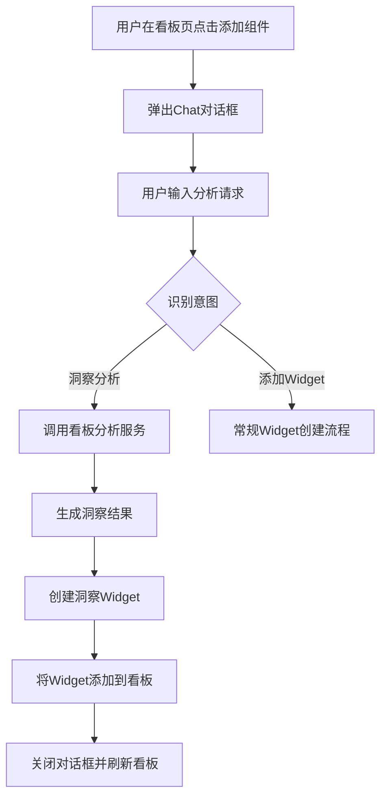
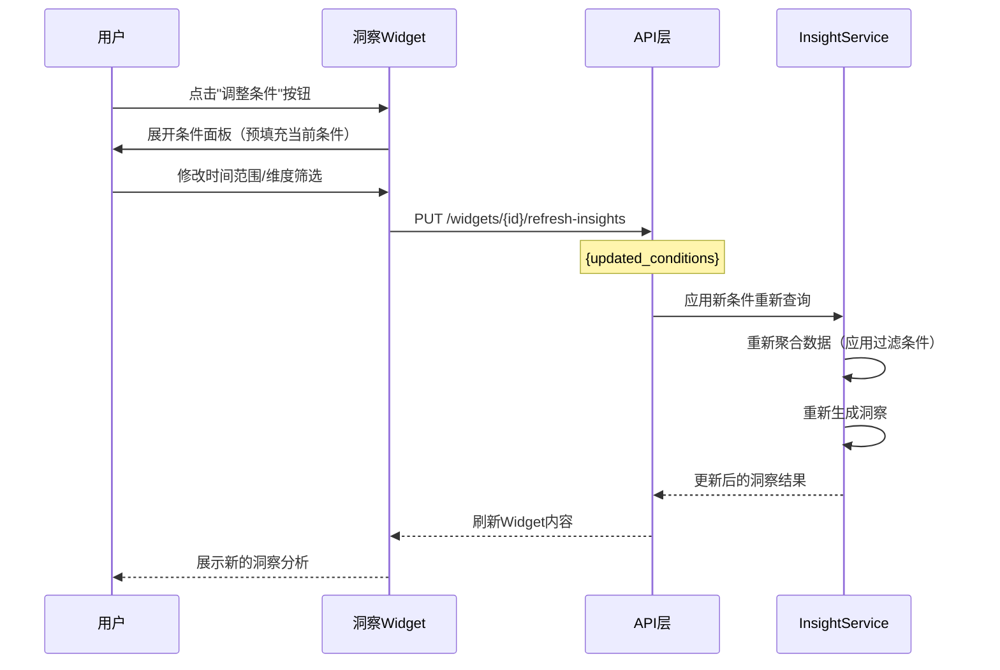
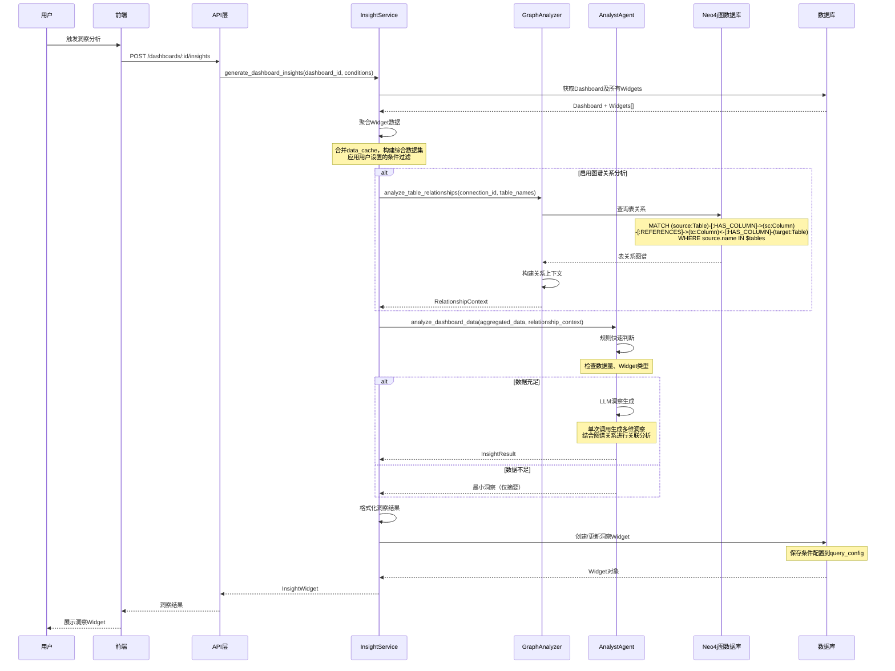
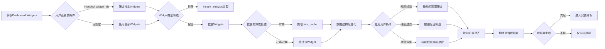
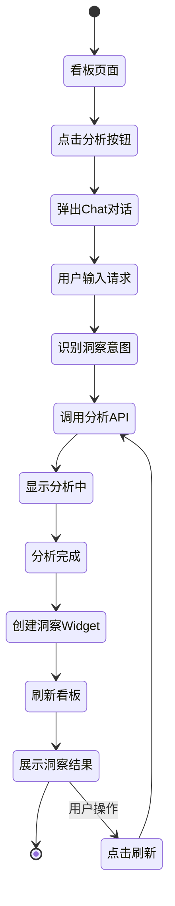

# BI看板数据洞察分析功能设计

## 功能概述

为BI仪表盘系统新增智能数据洞察分析能力，当用户创建看板并添加组件后，系统能够：
1. 自动分析看板中所有组件的数据，生成综合性的业务洞察报告
2. 利用Neo4j图数据库中的表关系进行深度关联挖掘，发现跨表业务模式
3. 提供交互式查询条件调整能力，用户可修改时间范围等SQL条件动态刷新洞察
4. 将分析结果以特殊Widget形式展示在看板中，支持Chat对话交互

核心特性：
- 基于图谱关系的智能洞察：利用已构建的Neo4j表关系图谱，自动发现数据间的业务逻辑联系
- 交互式条件调整：洞察Widget支持用户自定义查询条件（时间范围、数据源筛选等），实时更新分析结果
- 不影响现有流程：独立功能模块，与现有连接、Schema分析、Text2SQL流程解耦

## 业务价值

### 核心价值
- 将被动数据查看转变为主动洞察发现
- 降低数据分析门槛，让非专业用户也能获得专业洞察
- 快速发现数据中的趋势、异常和机会
- 基于数据特征提供可执行的业务建议

### 应用场景
- 销售看板：自动分析销售趋势、识别高增长产品、预警库存异常
- 运营看板：发现用户行为模式、定位转化率瓶颈、推荐优化方向
- 财务看板：检测收支异常、分析成本结构、提示风险点
- 业务总览：跨指标关联分析、综合评估业务健康度

## 功能需求

### FR1: 看板数据聚合分析

**能力描述**：系统能够收集看板中所有Widget的数据，进行统一的综合分析。

**数据范围**：
- 从Dashboard中获取所有有效Widget组件
- 读取每个Widget的查询配置和数据缓存
- 过滤无效或过期的Widget数据
- 支持跨数据源的统一分析

**分析触发条件**：
- Widget数量 ≥ 2：生成综合洞察
- Widget数量 = 1：提示需要更多组件
- Widget数量 = 0：显示空状态引导

### FR2: 基于图谱的多维度洞察生成

**能力描述**：基于看板数据和Neo4j图谱关系生成多维度的智能洞察。

**洞察维度**：

| 维度 | 说明 | 输出内容 | 图谱增强能力 |
|------|------|----------|------------|
| 数据摘要 | 看板整体数据概览 | 总数据量、覆盖时间范围、关键指标汇总 | 识别涉及的表和关系数量 |
| 趋势分析 | 时间序列变化趋势 | 增长率、趋势方向、周期性特征、拐点识别 | 跨表时间序列联动分析 |
| 异常检测 | 识别数据异常点 | 离群值、突变点、异常模式、严重程度评估 | 基于关系发现关联异常 |
| 关联分析 | 指标间相关性分析 | 强相关指标对、因果关系推测、联动效应 | **利用图谱REFERENCES关系挖掘跨表业务关联** |
| 对比洞察 | 跨维度数据对比 | 区域对比、产品对比、时段对比、同环比 | 基于外键关系的维度钻取 |
| 业务建议 | 可执行的行动建议 | 优化方向、风险预警、机会识别、优先级排序 | 结合表关系提供结构化建议 |

**图谱关系挖掘能力**（新增）：

系统通过Neo4j查询Widget涉及的表关系，进行深度洞察：

```cypher
// 示例：查询Widget涉及的表及其关联表
MATCH (source:Table {connection_id: $connection_id})-[:HAS_COLUMN]->(sc:Column)-[:REFERENCES]->(tc:Column)<-[:HAS_COLUMN]-(target:Table)
WHERE source.name IN $widget_tables
RETURN source, target, sc, tc
```

洞察增强场景：
- 订单表 + 用户表（通过user_id关联）：分析用户购买行为与订单金额的关系
- 产品表 + 库存表（通过product_id关联）：发现热销产品的库存预警
- 区域表 + 销售表（通过region_id关联）：识别区域销售模式差异

### FR3: 洞察Widget展示

**能力描述**：将分析洞察以特殊Widget形式集成到看板中。

**Widget特性**：
- Widget类型：`insight_analysis`（新增类型）
- 位置策略：默认放置在看板顶部或首屏显著位置
- 视觉样式：使用渐变色背景和图标突出显示（参考现有AnalystInsightsCard样式）
- 交互能力：支持展开/收起、查看详情、刷新分析

**展示结构**：

```
┌─────────────────────────────────────────┐
│ 🔍 看板洞察分析              [刷新] [收起] │
├─────────────────────────────────────────┤
│ 📊 数据摘要                              │
│   - 总数据量：1,234条                     │
│   - 时间范围：2024-01 至 2024-12         │
│   - 关键指标：销售额 ￥2.5M              │
├─────────────────────────────────────────┤
│ 📈 趋势分析                              │
│   - 整体趋势：上升 ↑                     │
│   - 增长率：+23.5%                       │
│   - 关键发现：Q4显著增长                 │
├─────────────────────────────────────────┤
│ ⚠️ 异常检测                              │
│   - 华东地区销售额异常下降                │
│   - 产品A库存预警                        │
├─────────────────────────────────────────┤
│ 💡 业务建议（3条）                       │
│   1. 加强华东地区市场投入                │
│   2. 优化产品A补货策略                   │
│   3. 推广Q4成功经验到其他季度            │
└─────────────────────────────────────────┘
```

### FR4: Chat对话触发方式

**能力描述**：用户可通过Chat对话界面触发洞察分析。

**交互流程**：



**关键对话触发词**：
- "分析这个看板"
- "给我一些数据洞察"
- "帮我找找数据中的问题"
- "有什么业务建议"
- "洞察分析"

### FR5: 交互式查询条件与刷新机制

**能力描述**：支持用户自定义查询条件和多种刷新模式。

**交互式条件调整**（核心功能）：

洞察Widget提供查询条件编辑面板，用户可动态调整以下参数：

| 条件类型 | 可选项 | 示例 | 实现方式 |
|---------|--------|------|--------|
| 时间范围 | 最近7天/30天/自定义 | 2024-01-01 至 2024-12-31 | WHERE date_column BETWEEN ? AND ? |
| 数据源筛选 | 选择包含的Widget | Widget 1, 3, 5 | 仅分析选中的Widget数据 |
| 维度筛选 | 区域/产品/类别 | 华东地区、产品A | WHERE dimension_column = ? |
| 聚合粒度 | 日/周/月/季度 | 按月聚合 | GROUP BY DATE_FORMAT(date, '%Y-%m') |
| 对比基准 | 同比/环比/自定义 | 与去年同期对比 | 自动生成对比SQL |

**条件提取逻辑**：

系统从Widget的query_config中提取可调整的SQL条件：

1. 解析SQL语句，识别WHERE子句中的条件
2. 识别时间列（date、datetime、timestamp类型）
3. 识别维度列（分类字段、枚举字段）
4. 生成条件选择器UI配置

**条件调整流程**：



**刷新策略**：

| 刷新模式 | 触发方式 | 适用场景 |
|---------|---------|------|
| 条件驱动刷新 | 用户修改查询条件 | **主要模式**，实时响应用户探索 |
| 手动刷新 | 用户点击刷新按钮 | 保持条件不变，刷新最新数据 |
| 随Widget刷新 | 看板Widget刷新时自动触发 | 保持洞察与数据同步（Phase 2） |
| 定时刷新 | 设置刷新间隔（如每小时） | 实时监控场景（Phase 2） |

**刷新行为**：
- 根据新条件重新查询Widget数据
- 应用过滤条件后重新聚合数据
- 重新执行洞察分析逻辑
- 更新洞察Widget内容
- 记录刷新时间戳和使用的条件
- 失败时保留上次成功结果并提示

## 技术方案

### 技术选型建议

基于项目现有技术栈（FastAPI + LangGraph + LLM Agent架构），推荐方案：

**方案对比**：

| 维度 | 现有架构方案 | Power BI Embedded | Tellius AI |
|------|-------------|-------------------|------------|
| 集成难度 | ⭐ 低（复用现有代码） | ⭐⭐⭐ 高（需额外集成） | ⭐⭐⭐ 高（第三方依赖） |
| 成本 | ✅ 无额外成本 | ❌ 按用户/容量收费 | ❌ 企业级定价 |
| 灵活性 | ⭐⭐⭐ 高（完全可控） | ⭐⭐ 中（受限于API） | ⭐ 低（黑盒分析） |
| LLM能力 | ⭐⭐⭐ 强（已有Analyst Agent） | ⭐ 弱（无AI洞察） | ⭐⭐⭐ 强（但不可控） |
| 数据安全 | ⭐⭐⭐ 高（数据不出本地） | ⭐⭐ 中（需上传Azure） | ⭐ 低（第三方处理） |
| 维护成本 | ⭐⭐ 中（自主维护） | ⭐⭐⭐ 高（依赖微软） | ⭐⭐⭐ 高（供应商依赖） |

**推荐方案：基于现有架构扩展**

**推荐理由**：
1. 项目已有完整的Analyst Agent和分析工具库（analyst_utils.py）
2. 可复用现有LLM调用、数据处理、统计分析能力
3. 与Chat系统无缝集成，无需额外学习成本
4. 数据不离开本地环境，安全性高
5. 完全可控可定制，可快速迭代优化

**不推荐Power BI/Tellius的原因**：
- 增加外部依赖和成本
- 与现有Chat交互体验割裂
- 数据需要传输到外部服务
- 无法利用项目已有的Text2SQL和Schema知识
- 过度设计，项目规模不需要企业级BI工具

### 系统架构设计

**架构分层**：

```mermaid
graph TB
    subgraph 前端层
        A1[Dashboard页面] --> A2[洞察Widget组件]
        A1 --> A3[Chat对话面板]
        A2 --> A4[条件编辑面板]
    end
    
    subgraph API层
        B1[Dashboard API] --> B2[/dashboards/:id/insights]
        B2 --> B3[POST 生成洞察]
        B2 --> B4[GET 获取洞察]
        B2 --> B5[PUT 刷新洞察 + 条件参数]
    end
    
    subgraph 服务层
        C1[DashboardInsightService] --> C2[数据聚合器]
        C1 --> C3[洞察分析器]
        C1 --> C4[结果格式化器]
        C1 --> C5[条件解析器 - 新增]
        C2 --> C6[条件应用引擎 - 新增]
    end
    
    subgraph Agent层
        D1[DashboardAnalystAgent] --> D2[规则引擎]
        D1 --> D3[LLM洞察生成]
        D1 --> D4[多维分析工具]
        D1 --> D5[图谱关系查询 - 新增]
    end
    
    subgraph 数据层
        E1[(dashboards)] -.-> E2[(dashboard_widgets)]
        E2 -.-> E3[widget.data_cache]
        E3 -.-> D1
        E4[(Neo4j图数据库)] -.表关系.-> D5
        E5[(schema_tables/relationships)] -.元数据.-> D5
    end
    
    A1 --> B1
    A3 --> B1
    A4 --> B5
    B1 --> C1
    C1 --> D1
    D1 --> E1
    D5 --> E4
    D5 --> E5
```

**组件职责**：

| 组件 | 职责 | 输入 | 输出 |
|------|------|------|------|
| DashboardInsightService | 洞察服务编排 | dashboard_id, user_id, conditions | InsightWidget对象 |
| DataAggregator | 数据聚合 | List[Widget], conditions | AggregatedData |
| ConditionParser | 条件解析 | Widget query_config | List[AdjustableCondition] |
| ConditionEngine | 条件应用 | AggregatedData, conditions | FilteredData |
| GraphRelationshipAnalyzer | 图谱关系查询 | connection_id, table_names | RelationshipGraph |
| DashboardAnalystAgent | AI洞察生成 | AggregatedData + RelationshipGraph | InsightResult |
| InsightFormatter | 结果格式化 | InsightResult | WidgetConfig |

### 数据模型设计

**扩展Widget类型**：

无需新增表，复用现有 `dashboard_widgets` 表，新增Widget类型：

| 字段 | 值 | 说明 |
|------|-----|------|
| widget_type | `insight_analysis` | 标识为洞察分析Widget |
| title | "看板洞察分析" | Widget标题 |
| query_config | `{analysis_params}` | 分析参数配置 |
| chart_config | `null` | 洞察Widget无图表 |
| data_cache | `{insight_result}` | 缓存洞察结果 |

**query_config 结构**（扩展）：

| 字段 | 类型 | 说明 |
|------|------|------|
| analysis_scope | string | 分析范围：all_widgets / selected_widgets |
| included_widget_ids | array | 包含的Widget ID列表（空表示全部） |
| analysis_dimensions | array | 启用的分析维度：summary / trends / anomalies / correlations / recommendations |
| refresh_strategy | string | 刷新策略：manual / auto / condition_driven |
| last_analysis_at | timestamp | 上次分析时间 |
| **adjustable_conditions** | object | **可调整的查询条件配置（新增）** |
| **current_conditions** | object | **当前生效的条件值（新增）** |
| **use_graph_relationships** | boolean | **是否启用图谱关系分析（新增，默认true）** |

**adjustable_conditions 结构**：

| 字段 | 类型 | 说明 |
|------|------|------|
| time_range | object | 时间范围条件配置 |
| time_range.column | string | 时间列名（如 created_at） |
| time_range.type | string | 时间列类型（date/datetime/timestamp） |
| time_range.presets | array | 预设选项（如 ["最近7天", "最近30天", "本月", "自定义"]） |
| dimension_filters | array | 维度筛选条件配置 |
| dimension_filters[].column | string | 维度列名（如 region, category） |
| dimension_filters[].values | array | 可选值列表 |
| aggregation_level | object | 聚合粒度配置 |
| aggregation_level.options | array | 可选粒度（day/week/month/quarter） |

**current_conditions 结构**：

| 字段 | 类型 | 说明 |
|------|------|------|
| time_range | object | 当前时间范围 |
| time_range.start | string | 开始时间 |
| time_range.end | string | 结束时间 |
| dimension_filters | object | 当前维度筛选值（如 {region: '华东', category: 'A'}） |
| aggregation_level | string | 当前聚合粒度（如 'month'） |

**data_cache 结构（洞察结果）**：

| 字段 | 类型 | 说明 |
|------|------|------|
| summary | object | 数据摘要 |
| trends | object | 趋势分析结果 |
| anomalies | array | 异常列表 |
| correlations | array | 相关性列表 |
| recommendations | array | 业务建议列表 |
| metadata | object | 元数据（数据源数量、分析时间等） |

### 核心流程设计

**洞察生成主流程**（含图谱关系增强）：



**数据聚合策略**（含条件应用）：



**分析深度决策树**：

| 条件 | 分析深度 | 包含维度 |
|------|---------|---------|
| Widget数量 = 0 | 跳过分析 | 空状态提示 |
| Widget数量 = 1 | 最小分析 | 数据摘要 |
| Widget数量 ≥ 2，无时间列 | 基础分析 | 摘要 + 异常 + 建议 |
| Widget数量 ≥ 2，有时间列 | 标准分析 | 摘要 + 趋势 + 异常 + 建议 |
| Widget数量 ≥ 3，有时间列 + 多数值列 | 完整分析 | 所有维度（含关联分析） |

### Agent实现方案

**复用现有Analyst Agent架构**：

项目已有 `AnalystAgent`（位于 `backend/app/agents/agents/analyst_agent.py`），包含：
- 规则判断函数：`rule_based_analysis_check`
- 智能分析工具：`intelligent_analysis`
- 统计工具库：`analyst_utils.py`（含趋势、异常、相关性分析）

**扩展方案**：

创建 `DashboardAnalystAgent` 继承并扩展现有能力：

**核心差异**：

| 维度 | 现有AnalystAgent | DashboardAnalystAgent（新） |
|------|-----------------|---------------------------|
| 输入数据 | 单SQL查询结果 | 多Widget聚合数据 + 用户条件 |
| 分析范围 | 单一数据集 | 跨Widget综合分析 |
| 上下文 | 用户查询 + SQL | 看板业务上下文 + Widget关系 + **Neo4j表关系** |
| 输出格式 | Chat消息格式 | Widget配置格式 |

**新增能力**：

| 工具函数 | 功能 | 输入 | 输出 |
|---------|------|------|------|
| aggregate_widget_data | 聚合Widget数据 | List[Widget], conditions | AggregatedDataset |
| **query_graph_relationships** | **查询Neo4j图谱关系** | **connection_id, table_names** | **RelationshipGraph** |
| **analyze_cross_table_correlation** | **跨表关联分析** | **AggregatedDataset, RelationshipGraph** | **List[CrossTableInsight]** |
| business_context_enrichment | 业务上下文增强 | Dashboard + Widgets | ContextInfo |
| format_for_widget_display | Widget展示格式化 | InsightResult | WidgetConfig |

**图谱关系查询实现**：

位于 `backend/app/services/graph_relationship_service.py`（新增）：

关键查询逻辑：
1. 提取Widget涉及的表名（从 query_config 或 data_cache）
2. 连接Neo4j，查询表间关系
3. 构建关系图（表 -> 列 -> 外键 -> 关联表）
4. 识别关系类型（one-to-many, many-to-one, many-to-many）
5. 返回结构化的关系上下文

Cypher查询示例：
```cypher
// 查询指定表的直接关联表
MATCH (source:Table {connection_id: $connection_id})-[:HAS_COLUMN]->(sc:Column)-[r:REFERENCES]->(tc:Column)<-[:HAS_COLUMN]-(target:Table)
WHERE source.name IN $table_names
RETURN 
  source.name AS source_table,
  sc.name AS source_column,
  r.type AS relationship_type,
  tc.name AS target_column,
  target.name AS target_table,
  target.description AS target_description
ORDER BY source_table, target_table

// 查询二度关联表（更深层次的关系）
MATCH path = (source:Table)-[:HAS_COLUMN]->(:Column)-[:REFERENCES*1..2]->(:Column)<-[:HAS_COLUMN]-(target:Table)
WHERE source.connection_id = $connection_id 
  AND source.name IN $table_names
  AND source <> target
RETURN DISTINCT
  source.name AS source_table,
  target.name AS related_table,
  length(path) AS relationship_depth
LIMIT 10
```

**LLM Prompt设计**：

关键Prompt结构：

```
你是一个专业的BI数据洞察分析师，正在分析一个业务看板。

看板信息：
- 看板名称：{dashboard_name}
- 看板描述：{dashboard_description}
- 包含组件数量：{widget_count}

组件数据摘要：
{widget_summaries}
- Widget 1: {type} - {title} - 数据量: {row_count}
- Widget 2: ...

聚合数据特征：
- 总数据量：{total_rows}
- 时间范围：{date_range}
- 数值列：{numeric_columns}
- 关键指标：{key_metrics}

已检测到的统计信息：
{statistics}

请基于以上信息，生成综合的业务洞察分析，包括：
1. 数据摘要（重点指标汇总）
2. 趋势分析（如有时间序列数据）
3. 异常检测（突出重要异常）
4. 关联洞察（Widget间的关联发现）
5. 业务建议（3-5条可执行建议）

输出JSON格式：
{
  "summary": {...},
  "trends": {...},
  "anomalies": [...],
  "correlations": [...],
  "recommendations": [...]
}
```

### API接口设计

**新增API端点**：

**1. 生成看板洞察**

```
POST /api/dashboards/{dashboard_id}/insights
```

**请求体**：

| 字段 | 类型 | 必填 | 说明 |
|------|------|------|------|
| analysis_dimensions | array | 否 | 指定分析维度，默认全部 |
| included_widget_ids | array | 否 | 指定Widget，默认全部 |
| force_refresh | boolean | 否 | 强制重新分析，默认false |
| **conditions** | object | 否 | **用户自定义查询条件（新增）** |
| conditions.time_range | object | 否 | 时间范围 {start, end} |
| conditions.dimension_filters | object | 否 | 维度筛选 {column: value} |
| conditions.aggregation_level | string | 否 | 聚合粒度 (day/week/month) |
| **use_graph_relationships** | boolean | 否 | **是否启用图谱关系分析，默认true（新增）** |

**响应体**：

| 字段 | 类型 | 说明 |
|------|------|------|
| widget_id | integer | 创建的洞察Widget ID |
| insights | object | 洞察结果详情 |
| analyzed_widget_count | integer | 分析的Widget数量 |
| analysis_timestamp | string | 分析时间 |
| **applied_conditions** | object | **应用的条件（新增）** |
| **relationship_count** | integer | **发现的表关系数量（新增）** |

**2. 获取洞察Widget**

```
GET /api/dashboards/{dashboard_id}/insights
```

返回该看板的洞察Widget列表（通常只有一个）。

**3. 刷新洞察Widget（含条件更新）**

```
PUT /api/widgets/{widget_id}/refresh-insights
```

**请求体**：

| 字段 | 类型 | 必填 | 说明 |
|------|------|------|------|
| **updated_conditions** | object | 否 | **更新的查询条件（新增）** |
| updated_conditions.time_range | object | 否 | 新的时间范围 |
| updated_conditions.dimension_filters | object | 否 | 新的维度筛选 |
| updated_conditions.aggregation_level | string | 否 | 新的聚合粒度 |
| force_requery | boolean | 否 | 是否重新查询数据源，默认false |

**响应体**：同生成洞察接口

**4. Chat触发洞察**

复用现有 `/api/query/chat` 端点，在Supervisor Agent中新增洞察分析意图识别和路由。

### 前端实现方案

**组件结构**：

| 组件 | 文件位置 | 职责 |
|------|---------|------|
| DashboardInsightWidget | admin/src/components/DashboardInsightWidget.tsx | 洞察Widget展示组件 |
| **InsightConditionPanel** | **admin/src/components/InsightConditionPanel.tsx** | **条件编辑面板（新增）** |
| InsightAnalysisPanel | admin/src/components/InsightAnalysisPanel.tsx | 洞察详情面板（可选） |
| ChatInsightTrigger | admin/src/components/ChatInsightTrigger.tsx | Chat触发按钮和对话 |

**复用现有组件**：

项目已有 `AnalystInsightsCard`（位于 `frontend/chat/src/components/AnalystInsightsCard.tsx`），可复用其样式和结构。

**UI设计要点**：

| 元素 | 设计要求 |
|------|----------|
| 视觉突出 | 渐变色背景（紫色到粉色），顶部图标 |
| 信息层级 | 标题 > 条件显示 > 维度卡片 > 详细内容 |
| 可操作性 | **调整条件按钮、**刷新按钮、展开/收起、查看详情链接 |
| 响应式 | 适配不同屏幕尺寸，移动端友好 |
| 加载状态 | 分析中显示加载动画和进度提示 |

**条件编辑面板设计**（新增）：

```
┌─────────────────────────────────────────┐
│ 🛠️ 调整分析条件                   [确定] [取消] │
├─────────────────────────────────────────┤
│ 📅 时间范围                                      │
│   [ 最近7天 | 最近30天 | 本月 | 自定义 ]      │
│   自定义: [2024-01-01] 至 [2024-12-31]       │
├─────────────────────────────────────────┤
│ 🎯 维度筛选                                      │
│   区域: [✓ 全部] [☐ 华东] [☐ 华北] ...       │
│   类别: [✓ 全部] [☐ 产品A] [☐ 产品B] ...      │
├─────────────────────────────────────────┤
│ 📊 聚合粒度                                      │
│   [ 按天 | 按周 | 按月 | 按季度 ]             │
├─────────────────────────────────────────┤
│ 📊 数据源                                        │
│   [✓] Widget 1: 销售趋势                        │
│   [✓] Widget 2: 用户增长                        │
│   [☐] Widget 3: 库存状态                        │
└─────────────────────────────────────────┘
```

**交互流程**：



## 实施计划

### Phase 1：核心功能（推荐先实施）

**范围**：
- 数据聚合能力
- 基础洞察生成（摘要、趋势、异常、建议）
- 洞察Widget展示
- 手动刷新功能

**优先级**：高  
**预估工作量**：5-7天

### Phase 2：Chat集成（后续优化）

**范围**：
- Chat对话触发
- 意图识别和路由
- 对话式洞察交互

**优先级**：中  
**预估工作量**：3-4天

### Phase 3：高级分析（未来增强）

**范围**：
- 跨Widget关联分析
- 预测性分析
- 自定义分析维度
- 定时自动刷新

**优先级**：低  
**预估工作量**：待评估

## 非功能需求

### 性能要求

| 指标 | 目标值 | 说明 |
|------|--------|------|
| 洞察生成时间 | < 5秒 | 2-5个Widget的看板 |
| 洞察生成时间 | < 10秒 | 6-10个Widget的看板 |
| 并发处理能力 | 支持10个用户同时分析 | 单服务器配置下 |
| LLM调用次数 | 1次/分析 | 控制成本 |

**性能优化策略**：
- 规则快速判断，减少不必要的LLM调用
- 数据聚合阶段采样处理（超过1000行时）
- 洞察结果缓存在Widget中
- 异步生成，避免阻塞用户操作

### 可用性要求

| 场景 | 处理策略 |
|------|---------|
| Widget无数据 | 显示提示信息，跳过该Widget |
| 所有Widget无数据 | 显示空状态，引导用户添加数据Widget |
| LLM调用失败 | 降级到规则分析，返回基础摘要 |
| 分析超时 | 超时10秒返回部分结果 |

### 安全要求

| 维度 | 要求 |
|------|------|
| 权限控制 | 继承Dashboard权限，只有有权限的用户可查看洞察 |
| 数据隐私 | 敏感数据在发送LLM前脱敏处理 |
| API鉴权 | 复用现有用户认证机制 |

## 风险与挑战

### 技术风险

| 风险 | 影响 | 缓解措施 |
|------|------|---------|
| LLM生成质量不稳定 | 洞察不准确或不相关 | 规则预处理 + Prompt优化 + 人工反馈循环 |
| 跨Widget数据对齐困难 | 无法进行关联分析 | Phase 1仅做基础分析，Phase 3再处理复杂关联 |
| 大数据量分析性能 | 生成时间过长 | 数据采样 + 异步处理 + 进度提示 |

### 业务风险

| 风险 | 影响 | 缓解措施 |
|------|------|---------|
| 用户对洞察质量期望过高 | 用户满意度低 | 明确标注为"AI辅助洞察"，提供反馈入口 |
| 洞察与实际业务不符 | 误导决策 | 添加免责声明，建议结合人工判断 |

## 验收标准

### 功能验收

- [ ] 可以为包含2个以上Widget的看板生成洞察
- [ ] 洞察Widget正确展示在看板中
- [ ] 洞察包含至少3个维度（摘要、趋势、建议）
- [ ] 手动刷新功能正常工作
- [ ] Chat对话可触发洞察生成（Phase 2）

### 质量验收

- [ ] 95%的洞察生成请求在10秒内完成
- [ ] 洞察内容与数据特征相符（人工抽检）
- [ ] 无数据泄露和权限绕过问题
- [ ] 异常场景有友好提示

### 用户体验验收

- [ ] 洞察Widget视觉突出且美观
- [ ] 分析过程有明确进度反馈
- [ ] 交互流畅无卡顿
- [ ] 移动端展示正常
| API鉴权 | 复用现有用户认证机制 |

## 风险与挑战

### 技术风险

| 风险 | 影响 | 缓解措施 |
|------|------|---------|
| LLM生成质量不稳定 | 洞察不准确或不相关 | 规则预处理 + Prompt优化 + 人工反馈循环 |
| 跨Widget数据对齐困难 | 无法进行关联分析 | Phase 1仅做基础分析，Phase 3再处理复杂关联 |
| 大数据量分析性能 | 生成时间过长 | 数据采样 + 异步处理 + 进度提示 |

### 业务风险

| 风险 | 影响 | 缓解措施 |
|------|------|---------|
| 用户对洞察质量期望过高 | 用户满意度低 | 明确标注为"AI辅助洞察"，提供反馈入口 |
| 洞察与实际业务不符 | 误导决策 | 添加免责声明，建议结合人工判断 |

## 验收标准

### 功能验收

- [ ] 可以为包含2个以上Widget的看板生成洞察
- [ ] 洞察Widget正确展示在看板中
- [ ] 洞察包含至少3个维度（摘要、趋势、建议）
- [ ] 手动刷新功能正常工作
- [ ] Chat对话可触发洞察生成（Phase 2）

### 质量验收

- [ ] 95%的洞察生成请求在10秒内完成
- [ ] 洞察内容与数据特征相符（人工抽检）
- [ ] 无数据泄露和权限绕过问题
- [ ] 异常场景有友好提示

### 用户体验验收

- [ ] 洞察Widget视觉突出且美观
- [ ] 分析过程有明确进度反馈
- [ ] 交互流畅无卡顿
- [ ] 移动端展示正常
