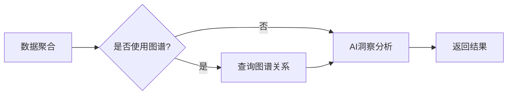

# Dashboard洞察分析智能体

## 概述

Dashboard洞察分析智能体是一个专门用于分析BI看板数据的AI Agent，基于LangGraph框架构建，能够自动聚合多个Widget的数据，结合Neo4j图谱关系，生成综合性的业务洞察报告。

## 智能体架构

### 工作流节点



### 核心组件

1. **DashboardAnalystAgent** (`dashboard_analyst_agent.py`)
   - 基于LLM的智能分析师
   - 支持多维度洞察生成
   - 自动降级处理

2. **DashboardInsightGraph** (`dashboard_insight_graph.py`)
   - LangGraph工作流编排
   - 状态管理
   - 节点流转控制

3. **GraphRelationshipService** (`graph_relationship_service.py`)
   - Neo4j图谱查询
   - 表关系提取
   - 关系上下文构建

## 使用方式

### 方式1：通过Service调用（推荐）

```python
from app.services.dashboard_insight_service import dashboard_insight_service

# 生成洞察
response = dashboard_insight_service.generate_dashboard_insights(
    db=db,
    dashboard_id=11,
    user_id=1,
    request=DashboardInsightRequest(
        use_graph_relationships=True,
        conditions=InsightConditions(
            time_range=TimeRange(
                start_date="2024-01-01",
                end_date="2024-12-31"
            )
        )
    )
)
```

### 方式2：直接使用LangGraph图

```python
from app.agents.dashboard_insight_graph import analyze_dashboard

# 分析Dashboard
result = await analyze_dashboard(
    dashboard=dashboard_obj,
    aggregated_data={
        "data": [...],
        "total_rows": 1000,
        "table_names": ["orders", "users"],
        ...
    },
    use_graph_relationships=True
)

insights = result["insights"]
```

### 方式3：通过API接口

```bash
# 生成洞察
curl -X POST http://localhost:8000/api/dashboards/11/insights \
  -H "Content-Type: application/json" \
  -d '{
    "use_graph_relationships": true,
    "conditions": {
      "time_range": {
        "relative_range": "last_30_days"
      }
    }
  }'

# 刷新洞察
curl -X PUT http://localhost:8000/api/widgets/{widget_id}/refresh-insights \
  -H "Content-Type: application/json" \
  -d '{
    "updated_conditions": {
      "time_range": {
        "start_date": "2024-01-01",
        "end_date": "2024-12-31"
      }
    }
  }'
```

## 洞察维度

智能体会生成以下维度的洞察：

### 1. 数据摘要 (Summary)
- 总数据量
- 关键指标汇总
- 时间范围

### 2. 趋势分析 (Trends)
- 趋势方向（上升/下降/平稳）
- 增长率
- 关键拐点

### 3. 异常检测 (Anomalies)
- 离群值
- 突变点
- 异常模式
- 严重程度

### 4. 关联洞察 (Correlations)
- **跨表关联**（基于Neo4j图谱）
- Widget间相关性
- 业务联动效应

### 5. 业务建议 (Recommendations)
- 优化方向
- 风险预警
- 机会识别
- 优先级排序

## 图谱增强能力

当启用 `use_graph_relationships=True` 时，智能体会：

1. 查询Neo4j图数据库获取表关系
2. 识别外键关联（REFERENCES关系）
3. 构建关系上下文
4. 在Prompt中注入关系信息
5. 生成跨表关联洞察

示例关系查询：
```cypher
MATCH (source:Table)-[:HAS_COLUMN]->(sc:Column)-[:REFERENCES]->(tc:Column)<-[:HAS_COLUMN]-(target:Table)
WHERE source.connection_id = $connection_id 
  AND source.name IN $table_names
RETURN source, target, sc, tc
```

## 配置说明

### LangGraph配置 (`langgraph.json`)

```json
{
  "graphs": {
    "sql_agent": {
      "path": "./app/agents/chat_graph.py:graph"
    },
    "dashboard_insight_agent": {
      "path": "./app/agents/dashboard_insight_graph.py:dashboard_insight_graph"
    }
  }
}
```

### 环境变量

确保 `.env` 文件配置了以下变量：

```bash
# LLM配置
OPENAI_API_KEY=your_api_key
OPENAI_BASE_URL=https://api.openai.com/v1
LLM_PROVIDER=openai  # 或 deepseek

# Neo4j配置（用于图谱关系）
NEO4J_URI=bolt://localhost:7687
NEO4J_USER=neo4j
NEO4J_PASSWORD=your_password
```

## 性能优化

### 数据量处理策略

| 数据行数 | 分析级别 | 说明 |
|---------|---------|------|
| < 2行 | skip | 跳过分析 |
| 2-1000行 | full_analysis | 完整分析 |
| > 1000行 | summary_only | 仅摘要 |

### LLM调用优化

- **单次调用**：所有洞察维度在一次LLM调用中生成
- **Prompt优化**：精简上下文，只传递关键信息
- **降级机制**：LLM失败时自动切换到规则方案

## 测试

### 单元测试

```bash
# 测试Dashboard洞察图
python -m pytest backend/tests/test_dashboard_insight_graph.py -v

# 测试分析师Agent
python -m pytest backend/tests/test_dashboard_analyst_agent.py -v
```

### 手动测试

```bash
# 测试图创建
cd backend
python -m app.agents.dashboard_insight_graph

# 预期输出
# Dashboard洞察分析图创建成功
# 图节点: ['aggregate_data', 'query_relationships', 'analyze_insights']
```

## 故障排查

### 问题1：LLM调用失败

**原因**：API Key配置错误或网络问题

**解决**：
1. 检查 `.env` 中的 `OPENAI_API_KEY`
2. 验证 `OPENAI_BASE_URL` 是否正确
3. 查看日志：`tail -f backend/logs/app.log`

### 问题2：图谱关系为空

**原因**：Neo4j未配置或表关系未导入

**解决**：
1. 确认Neo4j服务运行：`docker ps | grep neo4j`
2. 检查连接配置：`NEO4J_URI`, `NEO4J_USER`, `NEO4J_PASSWORD`
3. 重新导入Schema：`POST /api/schema/import`

### 问题3：洞察质量不佳

**原因**：数据量不足或Prompt需要优化

**解决**：
1. 确保Dashboard有足够的Widget（≥2个）
2. 检查Widget数据缓存是否有效
3. 调整分析维度参数
4. 优化LLM Prompt（修改 `dashboard_analyst_agent.py`）

## 扩展开发

### 添加新的分析维度

1. 在 `schemas/dashboard_insight.py` 添加Schema定义
2. 在 `dashboard_analyst_agent.py` 更新Prompt和解析逻辑
3. 在前端 `DashboardInsightWidget.tsx` 添加展示组件

### 集成新的数据源

1. 在 `dashboard_insight_service.py` 扩展 `_aggregate_widget_data`
2. 支持新的Widget类型
3. 更新数据聚合逻辑

## 最佳实践

1. **启用图谱关系**：充分利用Neo4j的关联分析能力
2. **合理设置条件**：通过时间范围和维度筛选减少数据量
3. **定期刷新**：建议每天自动刷新一次洞察
4. **监控性能**：关注LLM调用时间和成功率
5. **用户反馈**：收集洞察质量反馈，持续优化Prompt

## 参考资料

- [LangGraph文档](https://langchain-ai.github.io/langgraph/)
- [Neo4j Python驱动](https://neo4j.com/docs/python-manual/)
- [FastAPI最佳实践](https://fastapi.tiangolo.com/tutorial/)
